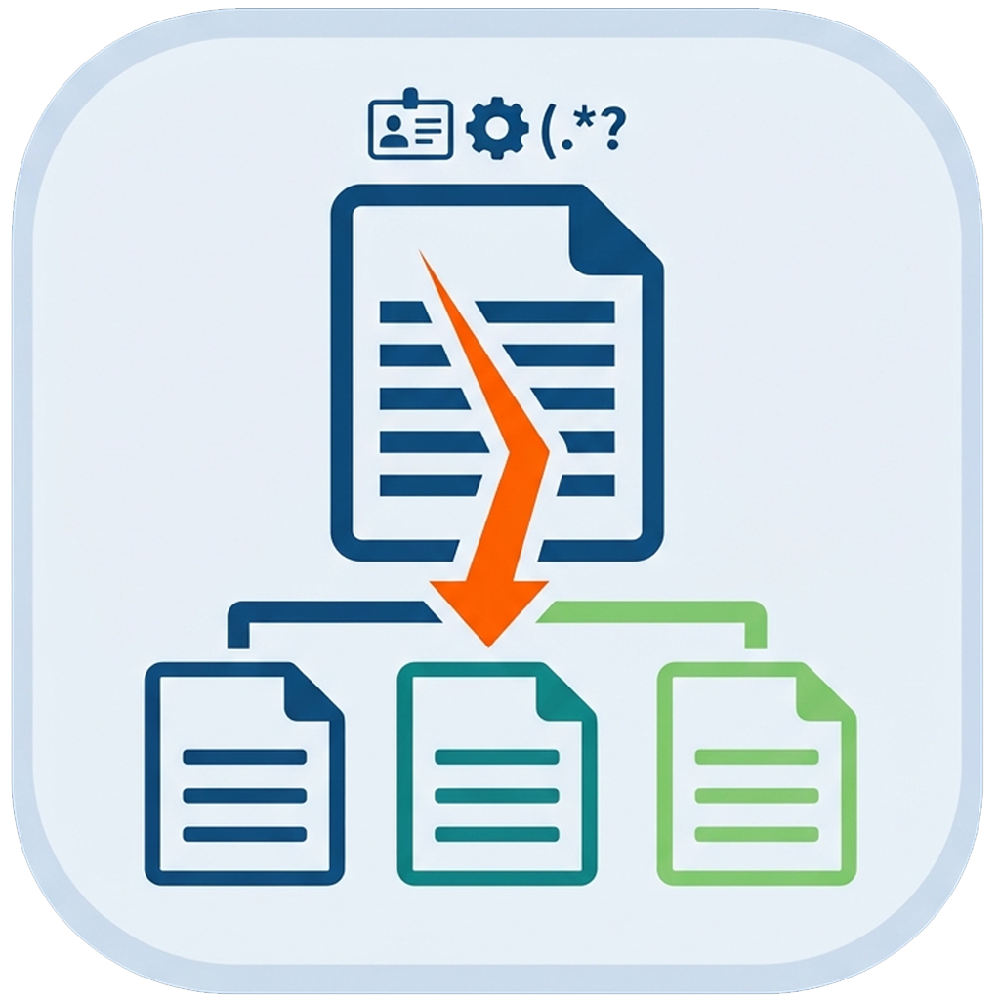

<div align="center">



# ForceSplit

**不懂技术，也能把数据表按规则拆成多份。**

数据文件按字段规则拆分工具（Windows）：XLSX / XLS / CSV 按业务规则拆分成多个文件

**✂️ 7 种拆分规则 &nbsp;·&nbsp; 👀 拆分前预览确认 &nbsp;·&nbsp; ⚖️ 行数守恒核对 &nbsp;·&nbsp; 📚 8 个内置数据集 &nbsp;·&nbsp; 🧩 拆分方案复用 &nbsp;·&nbsp; 🔒 全程本地处理零上传**

`Windows 10 / 11` · `XLSX / XLS / CSV` · `公测版 v0.9.0`

[官网 forcesplit.weibaba.fun](https://forcesplit.weibaba.fun) · [从微软商店下载](https://apps.microsoft.com/detail/9MXMRG84K642) · [隐私政策](https://forcesplit.weibaba.fun/privacy/)

☕ 觉得好用？[请作者喝杯咖啡](#请作者喝杯咖啡)

</div>

## 支持格式与拆分规则

支持 **XLSX / XLS / CSV** 三种数据文件格式，单表最多 200,000 行，超出自动续接新 sheet。提供 7 种拆分规则：

| 拆分规则 | 说明 |
|---|---|
| 按字段值（逐户） | 同一字段值的行归入同一个文件，逐户、逐单位、逐客户 |
| 按行政区划 | 依据身份证号、纳税人识别号或区划代码，按省 / 市 / 县三级拆分，支持扁平或分层目录 |
| 按日期 | 按年、季、月、周、日归档 |
| 按数值区间 | 金额、数量等数值列按区间分段 |
| 按前缀 / 关键字 | 按文本前缀或包含关键字归类 |
| 按行数 | 固定行数切成多个文件 |
| 按手机归属地 | 依据手机号识别省 / 市与运营商 |

## 功能亮点

- **拆分前预览确认**：先预览拆分结果与预处理，确认无误再输出。
- **行数守恒核对**：拆分前后总行数自动核对，一行不丢、一行不重。
- **输出字段过滤**：每份输出文件只保留需要的字段。
- **拆分方案复用**：常用拆分规则保存为方案，下次一键套用。
- **内置基础数据**：行政区划（2023 版）、手机号段（490,000 条）等 8 个数据集内置，应用内可管理、可编辑。

## 隐私

ForceSplit **全程在本地处理数据**：无网络请求、无遥测、无广告；设置与拆分方案存储于本机用户目录。详见[隐私政策](https://forcesplit.weibaba.fun/privacy/)。

## 反馈与支持

- 📧 反馈邮箱：[forcesplit@weibaba.fun](mailto:forcesplit@weibaba.fun)
- 🏪 下载与版本信息：[微软商店页面](https://apps.microsoft.com/detail/9MXMRG84K642)

## 关于本仓库

本仓库托管 ForceSplit 官方网站（[forcesplit.weibaba.fun](https://forcesplit.weibaba.fun)）源码：纯静态、零追踪（无统计、无 Cookie、无外部请求），站点口径以 [`docs/site-design.md`](docs/site-design.md) 为准。

### 开发者说明

本站为纯静态 HTML / CSS 页面，**无需任何构建步骤**：仓库根即站点根，直接以任意静态服务器托管即可。本地预览：

```bash
python -m http.server 8000
```

## English

ForceSplit is a Windows desktop tool that splits XLSX / XLS / CSV data files into multiple files by field-based business rules — 7 splitting rules (field value, administrative region, date, numeric range, prefix/keyword, row count, phone number region), with preview before splitting, row-count verification, output field filtering, reusable split plans, built-in reference data, and fully local processing with zero uploads. Public Beta v0.9.0 is available from the [Microsoft Store](https://apps.microsoft.com/detail/9MXMRG84K642). See the [English website](https://forcesplit.weibaba.fun/en/) for details.

## 致谢

ForceSplit 站在开源社区的肩膀上——具体开源组件清单以应用内「关于」页与随软件分发的第三方许可声明为准，向各开源项目作者与贡献者致以诚挚谢意。

## 请作者喝杯咖啡

如果 ForceSplit 帮到了你，欢迎请作者喝杯咖啡 ☕——你的支持就是持续更新的动力。

<p align="center">
  
</p>

> 微信「扫一扫」上方收款码即可支持，金额随意，心意最重要。赞助不会带来任何功能差异。
